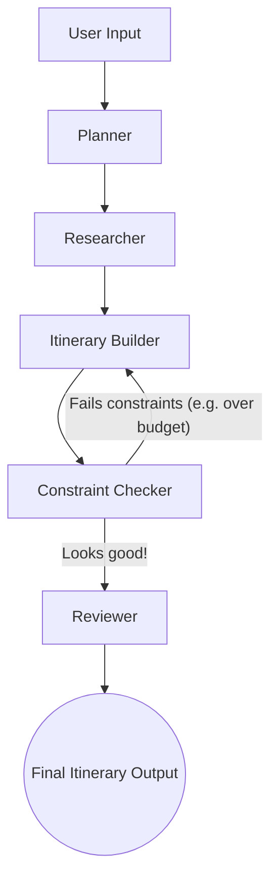

# AI Travel Planner ✈️

Hi! Welcome to my AI Travel Planner. This is an application I built using **LangGraph** and **Streamlit** to act like a real, multi-agent travel agency. Instead of just talking to a single chatbot and hoping it remembers all your constraints, this app passes your request through a series of specialized AI agents that research, build, and fact-check a day-by-day vacation itinerary.

It even scrapes live cost-of-living data from the web so its budget estimates are actually grounded in reality, not just hallucinated by the AI.

---

## How It Works (The Architecture)

I used LangGraph to build a "State Graph". Basically, we have a central `TravelState` dictionary that gets passed along from agent to agent. Here's what the workflow looks like:



### The Agents I Built:

1. **Planner**: The "brains" of the operation. It reads your prompt and extracts the hard facts (where you want to go, how many days, budget, and preferred pace).
2. **Researcher**: The research assistant. It searches the web (using Tavily/DuckDuckGo) for top attractions. Crucially, it also scrapes Numbeo.com to find out exactly how much a coffee or a taxi costs in that city today.
3. **Itinerary Builder**: Takes the research and drafts a day-by-day plan.
4. **Constraint Checker**: The strict manager. It looks at the drafted itinerary and checks it against the original constraints. If you asked for a "relaxed" pace but the builder crammed in 6 activities a day, the checker kicks it back to be rewritten.
5. **Reviewer**: A copy editor that formats the final, approved draft into nicely readable markdown.

---

## Memory

To make the app feel personalized, I set up two types of memory:

- **Chat History (Short-Term)**: I attached LangGraph's `MemorySaver` checkpointer so that every chat gets a unique ID. You can start a chat, switch to another trip, and switch back without losing your place.
- **User Profile (Long-Term)**: I used `InMemoryStore` to keep track of your overall travel style across sessions. If you mention you like luxury hotels and vegan food during your first trip, the system saves that into a profile. The next time you ask for a trip anywhere, the Planner automatically factors those preferences in.

---

## Running the App

It's super easy to get running on your local machine:

**1. Install the dependencies:**

```command prompt
python -m venv venv
venv\Scripts\activate
pip install -r requirements.txt
```

```if mac(terminal)
python -m venv venv
source venv/bin/activate
pip install -r requirements.txt
```

**2. Set up your API Keys:**
Make sure you have an `.env` file with your `OPENAI_API_KEY` and `TAVILY_API_KEY`.

**3. Run Streamlit:**

```command prompt
streamlit run main.py
```

## Known Limitations

- **Scraping blocks**: Because I'm openly scraping Numbeo with BeautifulSoup, heavy usage might trigger CAPTCHA blocks. When that happens, the app falls back to letting the LLM estimate prices.
- **It can be a bit slow**: Passing a massive JSON state through 5 different LLM nodes takes time. Expect to wait 15-30 seconds for a complex trip to generate.
